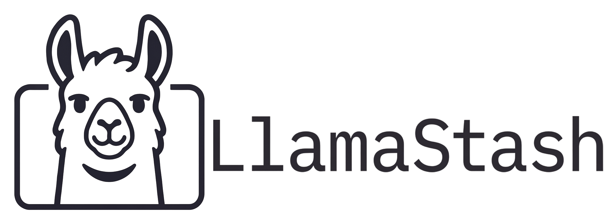

# LlamaStash



A fast, keyboard-driven TUI **and** CLI with init wizard for launching local LLMs via [llama.cpp](https://github.com/ggml-org/llama.cpp).

## Why

Heavy abstractions (Ollama, LM Studio) hide llama.cpp; raw `llama-server` use is tedious. LlamaStash is a fast, transparent launcher that is also a first-class shell-tool surface for agents — one binary, daemon on demand, same primitives in the TUI and the CLI.

> **AI agents installing this for a user:** jump to [`INSTALL.md` § For AI agents](INSTALL.md#for-ai-agents). The non-interactive install + verify contract, and exit-code branching live there.

## Install

Pick whichever channel you prefer — all install the same binary. Full per-platform notes, troubleshooting, and the agent-friendly non-interactive path live in [`INSTALL.md`](INSTALL.md).

```bash
# macOS + Linux, one-shot
curl -fsSL https://llamastash.cli.rs/install.sh | sh

# Homebrew (macOS + Linuxbrew)
brew install llamastash/llamastash/llamastash

# From crates.io (any platform with a Rust toolchain)
cargo install llamastash --locked
```

Then run `llamastash init` — the interactive wizard installs `llama-server` for your hardware, downloads a starter GGUF, writes a tuned config, and smoke-launches it.

## Quickstart

```bash
# Open the TUI. Scans default caches; daemon auto-spawns on demand.
llamastash

# List discovered models. TTY → padded + table; piped or
# `--no-colors` → TSV bytes. `--json` is the agent contract.
llamastash list
llamastash list --json | jq

# Launch a model by name, name substring, path, or canonical id.
llamastash start qwen-coder --ctx 16384 --reasoning on

# Drive a smoke-test request against the running endpoint.
curl -s http://127.0.0.1:41100/v1/chat/completions \
  -H 'Content-Type: application/json' \
  -d '{"model": "qwen-coder", "messages": [{"role": "user", "content": "hi"}]}'

# Stop it.
llamastash stop qwen-coder
```

Full subcommand reference: [`docs/usage.md`](docs/usage.md). Architecture and IPC contract: [`docs/architecture.md`](docs/architecture.md). When things go wrong: [`docs/troubleshooting.md`](docs/troubleshooting.md).

## Features

### Zero-to-chat in one command

- **`llamastash init` — first-run wizard.** Detects your hardware (NVIDIA, AMD/ROCm, Apple Metal, Vulkan, CPU), installs the right `llama-server` variant (Homebrew on macOS, integrity-verified GitHub Releases prebuilt on Linux), picks a starter GGUF tuned to your VRAM, downloads it into the HuggingFace cache, writes a tuned `config.yaml`, and smoke-launches it — all behind a stepped flow with live progress for every long step. `--recommended` accepts every default; `--only` / `--skip` scope re-runs after GPU swaps; `--json` + `--offline` make it agent-friendly.
- **Hardware-aware model recommender.** VRAM-fit hard filter + composite ranking (benchmark score × tok/s × params × recency) over a bundled benchmark snapshot refreshed daily by CI (Open-LLM-Leaderboard + Aider Polyglot + curated whichllm catalog). Every pick is auditable: VRAM headroom, benchmark source, estimated tok/s, parameter count, quantization.
- **`llamastash doctor` — read-only health check.** Compares your live setup against the snapshot init wrote, emits typed findings.

### Discovers what you already have

- **Auto-scans HuggingFace, Ollama, and LM Studio caches.** Plus any user paths you add. Models stream into the catalog incrementally; the TUI stays responsive while scanning.
- **Rich GGUF intelligence.** Header parser surfaces architecture, parameter count, quantization, native context length, embedded chat template, and reasoning hints. KV-cache-aware memory estimates that account for your chosen context length, not just weights.
- **Smart deduplication.** Symlinks dedupe to their target; split GGUFs (`*-00001-of-00003.gguf`) collapse into one logical entry; Ollama's content-addressed blobs surface under their human-readable name.
- **Live filesystem watching.** New GGUFs anywhere under the scan roots appear without restarting.

### Launches anything, supervises everything

- **Daemon-on-demand.** A single binary plays TUI, CLI, and background daemon. The first client auto-spawns the daemon; running models survive TUI close and daemon restart (three-factor orphan re-adoption: PID alive + port listening + `/v1/models` path match).
- **Multi-model concurrency.** Run as many models as your hardware can hold. Each gets its own port (auto-allocated from a configurable range) and a `Launching → Loading → Ready → Stopping → Stopped` state machine with `/health` probing.
- **GPU-aware built-in arch defaults.** A static `(architecture, gpu_backend) → flags` table ships in the binary — `llama*`, `qwen2*`, `qwen3*`, `mistral`, `mixtral`, `gemma*`, `phi*`, `deepseek*`, `granite`, `falcon`, `stablelm`, `command-r`, plus a `*` fallback. A fresh install gets sensible `n_gpu_layers` / `flash_attn` on every supported backend, with zero YAML to touch.
- **Typed launch-knob editor.** Settings tab exposes `ctx`, `reasoning`, `n_gpu_layers`, `threads`, `cache_type_k/v`, `flash_attn`, `mlock`, `no_mmap`, `parallel`, `batch_size`, `ubatch_size`, `rope_freq_scale`, `keep`, plus a free-text `extras` row. Each row shows its **source chip** (`(user)`, `(last used)`, `(arch default)`, `(model default)`, `(server default)`) so you always know where the value came from. Layered resolver: `preset > last-params > yaml arch_defaults > built-in table > llama-server`.
- **Named presets, favorites, last-params recall.** Save tuned launch profiles per model (`coding`, `long-ctx`, `fast`), star anything you launch often, and have your last successful launch params pre-populated next time.

### A TUI that doesn't get in your way

- **Keyboard-driven everywhere.** Vim-style navigation (`hjkl`), `/` filter, `f` favorite, `u`/`c`/`p` yank URL / curl / path, `t` cycle theme, `?` contextual help. Mouse is optional polish.
- **Right pane is your smoke test.** Tab-driven Logs / Chat / Embed / Rerank that hits the same OpenAI-compatible endpoints any external client would use — `<think>` blocks collapse in Chat; Embed shows vectors and optional cosine similarity; Rerank stages a query + candidate list. A successful smoke test proves the model is also usable from any external client.
- **In-TUI HuggingFace browser.** `d` opens a three-state modal — Search → File picker → Confirm — over the live HuggingFace `/api/models` endpoint. Search, sort by Downloads / Likes / Recently Updated / Trending, page-by-page pagination. The file picker collapses shard sets and marks per-file hardware fit (`✓` / `⚠` / `✗`). A pinned download strip surfaces progress and throughput; `Ctrl+X` cancels mid-chunk; `Ctrl+D` deletes a cached repo from disk.
- **Theming and rebinding.** Five built-in themes (Catppuccin Macchiato default + Latte, Gruvbox Dark, Solarized Dark, Monochrome) plus a `custom_theme` block accepting hex or ANSI names. Every TUI action is rebindable via a `keybindings:` block with a kdash-style key-spec dialect (`ctrl+q`, `shift+tab`, `f1`, …).
- **Accessible by default.** Status indicators are dual-encoded (color + glyph) so the UI stays legible on monochrome terminals.

### First-class CLI for agents and scripts

- **Subcommands cover every TUI capability.** `list`, `start`, `stop`, `status`, `logs`, `presets`, `favorites`, `last-params`, `daemon`, `init`, `doctor`, `pull`, `recommend` — every read+mutation command supports `--json` as the agent contract. `--no-spawn` opts out of the daemon auto-spawn for scripts that want to fail fast.
- **Documented exit codes per failure class.** `66` for ambiguous model reference, `67` for launch failure, `69` for `pull` failure, `70` for missing `llama-server`, `72`/`73`/`74` for init phases — pin against numbers, not message text.
- **Colored TTY output, byte-stable TSV when piped.** Padded + colored tables on a terminal; tab-separated rows when stdout isn't a TTY. `--no-colors` / `NO_COLOR=1` honored. `--json` output is byte-stable regardless.
- **`llamastash pull <hf-repo>` — standalone HF fetch.** Same `hf-hub`-backed primitive the wizard and the TUI dialog use; honors `HF_TOKEN`, refuses world-readable token files, does a disk-space precheck.
- **`llamastash recommend` — hardware-aware picks in your shell.** The wizard's recommender without the install / download / config-write steps. Pipe to `jq`.
- **Reproducible pulls via `--revision <SHA>`.** Pin HF downloads to a specific commit for agent and CI workflows.

### Built to be safe to run

- **Unix-socket peercred auth (`0600`).** Only your own UID can drive the daemon. No tokens to manage; no network surface in v1.
- **Hardened fetch substrate.** HTTPS-only with a host allowlist, redirect cap, body-size cap, IP-literal refusal. Used for benchmark snapshot fetch, GH Releases install, and HF API calls. `--offline` / `LLAMASTASH_OFFLINE` short-circuits before any DNS.
- **Archive-bomb defenses on installers.** Entry-count cap, total-size cap, compression-ratio cap; refuses hardlink, symlink, absolute-path, or `..` entries. SHA-256 verified before extract from the GitHub Releases asset's `digest` field.
- **Atomic, mode-checked config + state writes.** Temp-file + rename, refuses symlinks and group/world-writable parents, `0600` final mode. Corrupt `state.json` is quarantined to `state.json.broken-<ts>` and the daemon boots clean rather than refusing to start.
- **Side-by-side daemons.** `LLAMASTASH_STATE_DIR` / `LLAMASTASH_CONFIG_DIR` / `LLAMASTASH_CACHE_DIR` / `LLAMASTASH_SOCKET` let you run isolated instances without colliding on persisted state.

## Configuration

LlamaStash reads `$XDG_CONFIG_HOME/llamastash/config.yaml` (macOS: `~/Library/Application Support/llamastash/config.yaml`). A fully-annotated sample lives at [`config.example.yaml`](config.example.yaml) — copy it to the path above and edit. The full schema reference is in [`docs/usage.md`](docs/usage.md#configuration).

Quick tour of the top-level keys:

| Key                           | What it controls                                                                                                                                                          |
| ----------------------------- | ------------------------------------------------------------------------------------------------------------------------------------------------------------------------- |
| `theme`                       | Built-in palette: `macchiato` (default), `latte`, `gruvbox-dark`, `solarized-dark`, `mono`. Set to `custom` to use the `custom_theme` block. Cycle live with `t:theme`.   |
| `custom_theme`                | User-defined palette. Inherits unspecified slots from `base:` (default macchiato). Accepts `#RRGGBB` hex or ANSI names. Once defined, `Custom` joins the `t:theme` cycle. |
| `model_paths`                 | Extra directories to scan for `.gguf` files. Merged with `-p/--model-path` and `LLAMASTASH_MODEL_PATHS`.                                                                  |
| `disable_default_cache_paths` | Per-bucket toggles (`huggingface`, `ollama`, `lm_studio`) for the auto-walked caches.                                                                                     |
| `disable_scan`                | Skip filesystem scanning entirely. Same as `--no-scan` / `LLAMASTASH_NO_SCAN=1`.                                                                                          |
| `port_range`                  | Inclusive `{start, end}` TCP range the supervisor picks from. Default `41100..=41300`.                                                                                    |
| `llama_server_path`           | Absolute path to `llama-server`. Overridable by `--llama-server` and `LLAMASTASH_LLAMA_SERVER`.                                                                           |
| `probe_timeout_secs`          | Health-probe deadline per launch. Default `120`. Bump for 70B+ on slow disks.                                                                                             |
| `keybindings`                 | Action-name → key-spec overrides. Kdash-style dialect (`ctrl+q`, `shift+tab`, `f1`, …).                                                                                   |

Environment variables:

| Variable                  | Purpose                                                                                                                                                                                                                                                                                                        |
| ------------------------- | -------------------------------------------------------------------------------------------------------------------------------------------------------------------------------------------------------------------------------------------------------------------------------------------------------------- |
| `LLAMASTASH_CONFIG`       | Override config-file path                                                                                                                                                                                                                                                                                      |
| `LLAMASTASH_LLAMA_SERVER` | Path to `llama-server`                                                                                                                                                                                                                                                                                         |
| `LLAMASTASH_NO_SCAN`      | Skip filesystem scanning                                                                                                                                                                                                                                                                                       |
| `LLAMASTASH_SOCKET`       | Point a CLI at a non-default daemon socket                                                                                                                                                                                                                                                                     |
| `LLAMASTASH_OFFLINE`      | Disable outbound network for `init`, `pull`, and `doctor` fetch paths. Accepts `true` / `false` when bound via clap's `--offline` flag; the runtime `fetch::offline_requested` check also accepts `1` / `yes` for compatibility with scripts that follow the `XDG`/`gh` convention. Equivalent to `--offline`. |
| `HF_TOKEN`                | HuggingFace API token. Read by `init` and `pull` only; never propagated into spawned `llama-server` children. Cache-file (`~/.cache/huggingface/token`) source is refused if its mode is group/world-readable.                                                                                                 |
| `HF_ENDPOINT`             | Override the HuggingFace API endpoint host. Must be `https://` and on the HF-allowlist (`huggingface.co` and its LFS CDN); non-allowlisted values are refused. Default: `https://huggingface.co`.                                                                                                              |

### Default scan paths

When `model_paths` and `--model-path` are empty, LlamaStash walks these caches automatically. Each bucket is independently toggleable via `disable_default_cache_paths.<bucket>: true` in `config.yaml`, or globally via `--no-scan` / `LLAMASTASH_NO_SCAN=1`.

| Bucket      | Linux                                             | macOS                                                    |
| ----------- | ------------------------------------------------- | -------------------------------------------------------- |
| HuggingFace | `~/.cache/huggingface/hub`                        | `~/Library/Caches/huggingface/hub`                       |
| Ollama      | `~/.ollama/models`                                | `~/.ollama/models`                                       |
| LM Studio   | `~/.lmstudio/models`, `~/.cache/lm-studio/models` | `~/Library/Caches/LMStudio/models`, `~/.lmstudio/models` |

Files anywhere under these roots that end in `.gguf` (and aren't `.gguf.part`) get parsed and added to the catalog.

## CLI exit codes

Every non-interactive subcommand returns a documented exit code so agent scripts can branch on failure class. Pin against numbers, not message text — they are the public contract.

| Code | Meaning                                                                                                                                                                                                        |
| ---- | -------------------------------------------------------------------------------------------------------------------------------------------------------------------------------------------------------------- |
| `0`  | Success                                                                                                                                                                                                        |
| `64` | Usage error (missing required arg, invalid combination — clap-emitted)                                                                                                                                         |
| `65` | Daemon unreachable (socket missing, peer hung up, timeout)                                                                                                                                                     |
| `66` | Model reference matched zero or multiple models (stderr lists candidates)                                                                                                                                      |
| `67` | `start_model` failed at the supervisor (probe timeout, port allocation failure)                                                                                                                                |
| `68` | `stop_model` / `stop_all` failed                                                                                                                                                                               |
| `69` | `pull` download failed (transport, checksum, or HF cache write)                                                                                                                                                |
| `70` | `llama-server` binary not found (`--llama-server`, `LLAMASTASH_LLAMA_SERVER`, or `$PATH`)                                                                                                                      |
| `71` | Unexpected error (catch-all)                                                                                                                                                                                   |
| `72` | `init` aborted before substantive work — failed precondition, integrity check, or rate-limited GH API. Safe to re-run.                                                                                         |
| `73` | `init` download failed mid-step — disk space, transport, or HF cache write. Partial state recorded; re-run picks up where it stopped.                                                                          |
| `74` | `init` smoke-launch failed — phase-1 dry-run exceeded VRAM ceiling, or `--version` probe returned non-zero. Binary is installed; re-run smoke with `init --only smoke` or use `llamastash doctor` to diagnose. |

> **Note on sysexits.h**: the numbers above are deliberately reused from `<sysexits.h>` for familiarity, but LlamaStash's _meanings_ diverge from the standard ones. Scripts that import `EX_NOHOST` (68) expecting "host unreachable" will get our "stop failed"; `EX_DATAERR` (65) is reused for "daemon unreachable", not "data error". Branch on LlamaStash's table above, not the libc constants.

## Platforms

Linux (x86_64, aarch64) and macOS (Apple Silicon, Intel). Windows support is on the roadmap.

## Roadmap

Tracked in detail in [`TODO.md`](TODO.md). The headline items on deck after the first release:

- **llama.cpp version pinning** — prevent silent drift / incompatibility on `brew upgrade`.
- **HTTP and MCP server surfaces** — drive the daemon over the network and through the Model Context Protocol, not just the Unix socket.
- **Anthropic API compatibility** — `/v1/messages` shim on top of the existing OpenAI-compatible endpoints.
- **Per-PID VRAM attribution** via NVML's `nvmlDeviceGetComputeRunningProcesses`. Today the right pane shows per-model RAM + CPU%; VRAM is reported only at the host level.
- **GPU/CPU offload split UI** — first-class control over which layers go where.
- **Windows support** — first-class platform, not a port.
- **MLX and vLLM backends** — if the surface area lands cheaply alongside llama.cpp.
- **Docker-ready packaging** — official images plus a documented `docker run` path.

## Contributing

Bug reports, design discussion, and PRs welcome. Start with [`CONTRIBUTING.md`](CONTRIBUTING.md).

## AI Usage

Multiple AI Coding Harnesses and LLMs were heavily used to create this project.

## License

MIT © Deepu K Sasidharan

## Terms of use

- The Software shall be used for Good, not Evil.
- This software shall not be used for any military purposes including intelligence agencies.

## Related projects

- [`kdash`](https://github.com/kdash-rs/kdash) — Kubernetes dashboard TUI by the same author. LlamaStash borrows its engineering and release scaffolding from kdash: the org layout (`llamastash/llamastash`, `llamastash/homebrew-llamastash`, `llamastash/llamastash.github.io`), the brew-tap structure, the `cli.rs` subdomain setup, and the release-on-tag workflow shape. The product itself is independent.
- [`jwt-ui`](https://github.com/jwt-rs/jwt-ui) — JWT decoder / encoder TUI by the same author.

## Star history

If LlamaStash is useful to you, a star helps other people find it.

[](https://star-history.com/#llamastash/llamastash&Date)
