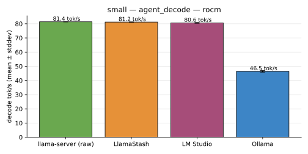
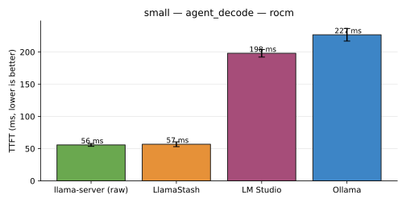
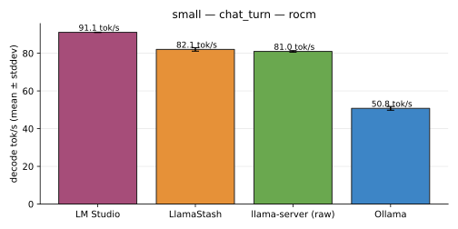
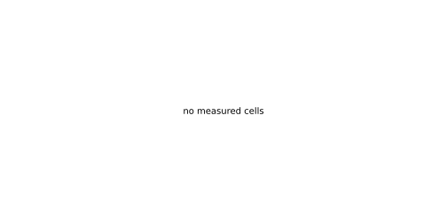

# Bench results — 2026-05-23

_Source: 1 run file(s) from host(s) deepu-flowz13-arch on backend(s) rocm._

> **First-run scope note.** This page is the first hardware run from
> the new bench harness. Scope:
>
> - **Model**: `gemma-4-E2B-it-Q4_K_M.gguf` (3,427,877,696 bytes), the
>   `small` slot from the R1 release checklist.
> - **Backend**: AMD ROCm gfx1151 (AMD Radeon 8060S / Ryzen AI Max+
>   395 Strix Halo APU).
> - **Tools**: LlamaStash, raw `llama-server`, Ollama, LM Studio — all
>   four loading the **same exact GGUF bytes**. Ollama imports from the
>   source path via Modelfile + SHA-256 verification on every cell; LM
>   Studio resolves to the same file via its indexed library (the
>   reported 4.6 GB for `google/gemma-4-e2b` is the Q4_K_M GGUF + the
>   bundled `mmproj` sidecar — the GGUF byte stream is identical).
> - **Engines**: LlamaStash + raw `llama-server` both use the local
>   llama.cpp build (b9282 HIP) via `$LLAMASTASH_LLAMA_SERVER`. Ollama
>   uses its own bundled llama.cpp build. LM Studio uses its bundled
>   Vulkan-AVX2 llama.cpp backend (the `~/.lmstudio/extensions/`
>   build). Same model bytes; *different inference engines* per tool —
>   that's what "default user experience" actually means here.
> - **Modes**: both `defaults` (each tool as a new user would invoke
>   it) and `normalized` (`ctx=4096, n_gpu_layers=999, flash_attn=on,
>   kv_cache_type=f16, batch_size=512, ubatch_size=512` to the extent
>   each tool accepts them — Ollama drops everything except `ctx`
>   onto `unfair_knobs`; LM Studio drops everything except `ctx` and a
>   `--gpu 1.0` ratio).
> - **Workloads**: `chat_turn` (short prompt, ≤64 decode tokens) and
>   `agent_decode` (short prompt, 256 decode tokens). `rag_prefill`
>   and `parallel_4` deferred.
> - **Reps**: 1 warmup + 3 measured per cell. Every cell passed the
>   variance gate (`stddev/mean < 10%`).
>
> The mid / large_dense / large_moe AMD-APU R1 models land in
> follow-up runs on the same page format.

See [methodology.md](methodology.md) for the matched-pair settings policy, the variance-gate rules, and the conflict-of-interest disclaimer. Charts are deterministic SVG — re-render from the source JSONs to verify.

## small — agent_decode

| Tool | Mode | decode tok/s | TTFT | prompt tok/s | reps | status |
|---|---|---|---|---|---|---|
| llama-server (raw) | defaults | 81.4 tok/s | 56.0 ms | 1,000.9 tok/s | 3 | ok |
| llama-server (raw) | normalized | 81.4 tok/s | 55.8 ms | 1,004.0 tok/s | 3 | ok |
| LlamaStash | defaults | 82.0 tok/s | 56.3 ms | 995.8 tok/s | 3 | ok |
| LlamaStash | normalized | 81.2 tok/s | 56.8 ms | 987.9 tok/s | 3 | ok |
| LM Studio | defaults | 80.5 tok/s | 199.4 ms | 280.8 tok/s | 3 | ok |
| LM Studio (batch_size, flash_attn, kv_cache_type, ubatch_size) | normalized | 80.6 tok/s | 198.1 ms | 282.9 tok/s | 3 | ok |
| Ollama | defaults | 47.8 tok/s | 220.8 ms | 258.7 tok/s | 3 | ok |
| Ollama (batch_size, flash_attn, kv_cache_type, n_gpu_layers, ubatch_size) | normalized | 46.5 tok/s | 226.8 ms | 251.6 tok/s | 3 | ok |

## small — chat_turn

| Tool | Mode | decode tok/s | TTFT | prompt tok/s | reps | status |
|---|---|---|---|---|---|---|
| llama-server (raw) | defaults | 81.4 tok/s | 51.4 ms | 935.2 tok/s | 3 | ok |
| llama-server (raw) | normalized | 81.0 tok/s | 51.0 ms | 940.7 tok/s | 3 | ok |
| LlamaStash | defaults | 82.1 tok/s | 50.7 ms | 946.6 tok/s | 3 | ok |
| LlamaStash | normalized | 82.1 tok/s | 51.0 ms | 942.3 tok/s | 3 | ok |
| LM Studio | defaults | 91.7 tok/s | 186.8 ms | 258.4 tok/s | 3 | ok |
| LM Studio (batch_size, flash_attn, kv_cache_type, ubatch_size) | normalized | 91.1 tok/s | 187.2 ms | 257.0 tok/s | 3 | ok |
| Ollama | defaults | 50.1 tok/s | 221.8 ms | 221.0 tok/s | 3 | ok |
| Ollama (batch_size, flash_attn, kv_cache_type, n_gpu_layers, ubatch_size) | normalized | 50.8 tok/s | 224.3 ms | 218.5 tok/s | 3 | ok |

