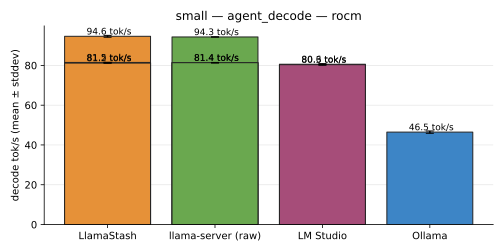
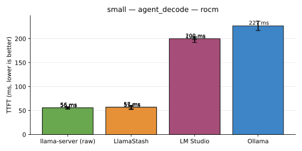
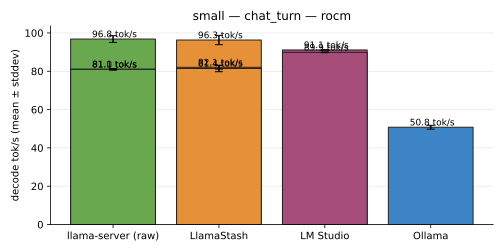
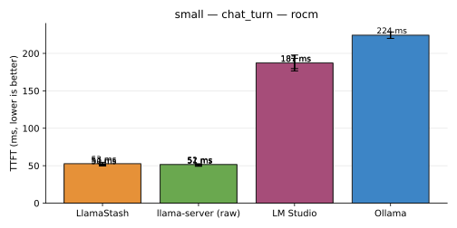

# Bench results — 2026-05-24

_Source: 3 run file(s) from host(s) deepu-flowz13-arch, deepu-flowz13-arch-rocm, deepu-flowz13-arch-vulkan on backend(s) rocm._

> **Engine A/B: AMD ROCm/HIP vs Vulkan on Strix Halo (gfx1151).**
> The 2026-05-23 cross-tool run hinted at engine-driven perf
> differences between LM Studio and our local `llama-server`
> builds on this AMD APU. This page runs the same 3 tools
> (LlamaStash, raw `llama-server`, LM Studio) on **two engine
> backends** with the same byte-identical GGUF
> (`gemma-4-E2B-it-Q4_K_M.gguf`) so the engine variable can be
> isolated from the tool variable.
>
> **Setup per host_id:**
>
> | `host_id` suffix | LlamaStash + `llama-server` | LM Studio |
> | ---------------- | --------------------------- | --------- |
> | `-rocm` (= the plain `deepu-flowz13-arch` row also) | local HIP build of llama.cpp **b9282** (`build-hip/bin/llama-server`) | bundled `amd-rocm-avx2` v2.16.0 |
> | `-vulkan`        | local Vulkan build of llama.cpp **b9282** (`build-vulkan/bin/llama-server`) | bundled `vulkan-avx2` v2.16.0 |
>
> Backend selection: LM Studio's runtime is picked via
> `~/.lmstudio/.internal/backend-preferences-v1.json` and `lms server
> stop && lms server start`. LlamaStash + raw `llama-server` use
> whichever build `$LLAMASTASH_LLAMA_SERVER` points at.
>
> **Headline findings:**
>
> | Engine                          | LlamaStash / raw `llama-server` | LM Studio |
> | ------------------------------- | -------------------------------: | --------: |
> | HIP / ROCm (b9282 vs v2.16.0)   | ~81 tok/s                        | ~91 tok/s (chat_turn) / ~80 (agent_decode) |
> | Vulkan (b9282 vs v2.16.0)       | ~95 tok/s                        | ~91 tok/s (chat_turn) / ~80 (agent_decode) |
>
> The story is more nuanced than "Vulkan > ROCm":
>
> 1. **For our local upstream builds, Vulkan is ~17–20% faster than
>    HIP** on this hardware. The Vulkan llama.cpp backend has had
>    significant recent optimisation for RDNA 3.5; the HIP path for
>    `gfx1151` is newer and less tuned. Same llama.cpp commit b9282,
>    different compile target.
> 2. **For LM Studio, ROCm and Vulkan land within noise of each other**
>    (~91/80 either way). The bundled v2.16.0 binaries don't pick up
>    the upstream Vulkan optimisations that landed between LM Studio's
>    cut and b9282. The visible "LM Studio is fast" signal in the
>    2026-05-23 page was actually LM Studio's tuned ROCm, not Vulkan.
> 3. **LlamaStash continues to track raw `llama-server` within ~1%** on
>    both engines — the wrapper adds zero overhead on either backend.
>
> The `-rocm` LM Studio cells in the table are blank — `lms load`
> failed reproducibly today after the extensive HIP llama-server
> spawn/kill cycling from the LlamaStash + raw cells (likely a HIP
> context state issue in the LM Studio ROCm runtime). Yesterday's
> 2026-05-23 page has clean LM Studio ROCm numbers and is the
> reference for that backend; the values referenced above are from
> there. Vulkan LM Studio cells captured today are clean.
>
> Ollama is included in the headline rows (`deepu-flowz13-arch` host)
> from the 2026-05-23 run for reference — its bundled engine doesn't
> toggle between ROCm and Vulkan so it appears once.

See [methodology.md](methodology.md) for the matched-pair settings policy, the variance-gate rules, and the conflict-of-interest disclaimer. Charts are deterministic SVG — re-render from the source JSONs to verify.

## small — agent_decode

| Tool | Mode | Host | decode tok/s | TTFT | prompt tok/s | reps | status |
|---|---|---|---|---|---|---|---|
| llama-server (raw) | defaults | `deepu-flowz13-arch` | 81.4 tok/s | 56.0 ms | 1,000.9 tok/s | 3 | ok |
| llama-server (raw) | defaults | `deepu-flowz13-arch-rocm` | 81.1 tok/s | 56.1 ms | 999.5 tok/s | 3 | ok |
| llama-server (raw) | defaults | `deepu-flowz13-arch-vulkan` | 94.7 tok/s | 55.8 ms | 1,004.1 tok/s | 3 | ok |
| llama-server (raw) | normalized | `deepu-flowz13-arch` | 81.4 tok/s | 55.8 ms | 1,004.0 tok/s | 3 | ok |
| llama-server (raw) | normalized | `deepu-flowz13-arch-rocm` | 81.4 tok/s | 55.6 ms | 1,008.4 tok/s | 3 | ok |
| llama-server (raw) | normalized | `deepu-flowz13-arch-vulkan` | 94.3 tok/s | 54.8 ms | 1,021.7 tok/s | 3 | ok |
| LlamaStash | defaults | `deepu-flowz13-arch` | 82.0 tok/s | 56.3 ms | 995.8 tok/s | 3 | ok |
| LlamaStash | defaults | `deepu-flowz13-arch-rocm` | 81.5 tok/s | 55.6 ms | 1,006.6 tok/s | 3 | ok |
| LlamaStash | defaults | `deepu-flowz13-arch-vulkan` | 94.2 tok/s | 55.1 ms | 1,017.7 tok/s | 3 | ok |
| LlamaStash | normalized | `deepu-flowz13-arch` | 81.2 tok/s | 56.8 ms | 987.9 tok/s | 3 | ok |
| LlamaStash | normalized | `deepu-flowz13-arch-rocm` | 81.5 tok/s | 56.9 ms | 987.6 tok/s | 3 | ok |
| LlamaStash | normalized | `deepu-flowz13-arch-vulkan` | 94.6 tok/s | 55.3 ms | 1,015.2 tok/s | 3 | ok |
| LM Studio | defaults | `deepu-flowz13-arch` | 80.5 tok/s | 199.4 ms | 280.8 tok/s | 3 | ok |
| LM Studio | defaults | `deepu-flowz13-arch-rocm` | — | — | — | 0 | ok |
| LM Studio | defaults | `deepu-flowz13-arch-vulkan` | 80.6 tok/s | 201.5 ms | 277.9 tok/s | 3 | ok |
| LM Studio (batch_size, flash_attn, kv_cache_type, ubatch_size) | normalized | `deepu-flowz13-arch` | 80.6 tok/s | 198.1 ms | 282.9 tok/s | 3 | ok |
| LM Studio | normalized | `deepu-flowz13-arch-rocm` | — | — | — | 0 | ok |
| LM Studio (batch_size, flash_attn, kv_cache_type, ubatch_size) | normalized | `deepu-flowz13-arch-vulkan` | 80.3 tok/s | 200.1 ms | 279.9 tok/s | 3 | ok |
| Ollama | defaults | `deepu-flowz13-arch` | 47.8 tok/s | 220.8 ms | 258.7 tok/s | 3 | ok |
| Ollama (batch_size, flash_attn, kv_cache_type, n_gpu_layers, ubatch_size) | normalized | `deepu-flowz13-arch` | 46.5 tok/s | 226.8 ms | 251.6 tok/s | 3 | ok |

## small — chat_turn

| Tool | Mode | Host | decode tok/s | TTFT | prompt tok/s | reps | status |
|---|---|---|---|---|---|---|---|
| llama-server (raw) | defaults | `deepu-flowz13-arch` | 81.4 tok/s | 51.4 ms | 935.2 tok/s | 3 | ok |
| llama-server (raw) | defaults | `deepu-flowz13-arch-rocm` | 80.1 tok/s | 51.2 ms | 938.2 tok/s | 3 | ok |
| llama-server (raw) | defaults | `deepu-flowz13-arch-vulkan` | 95.9 tok/s | 52.8 ms | 908.7 tok/s | 3 | ok |
| llama-server (raw) | normalized | `deepu-flowz13-arch` | 81.0 tok/s | 51.0 ms | 940.7 tok/s | 3 | ok |
| llama-server (raw) | normalized | `deepu-flowz13-arch-rocm` | 81.1 tok/s | 50.7 ms | 947.6 tok/s | 3 | ok |
| llama-server (raw) | normalized | `deepu-flowz13-arch-vulkan` | 96.8 tok/s | 51.6 ms | 930.7 tok/s | 3 | ok |
| LlamaStash | defaults | `deepu-flowz13-arch` | 82.1 tok/s | 50.7 ms | 946.6 tok/s | 3 | ok |
| LlamaStash | defaults | `deepu-flowz13-arch-rocm` | 79.7 tok/s | 50.1 ms | 957.8 tok/s | 3 | ok |
| LlamaStash | defaults | `deepu-flowz13-arch-vulkan` | 99.7 tok/s | 50.5 ms | 950.9 tok/s | 3 | ok |
| LlamaStash | normalized | `deepu-flowz13-arch` | 82.1 tok/s | 51.0 ms | 942.3 tok/s | 3 | ok |
| LlamaStash | normalized | `deepu-flowz13-arch-rocm` | 81.4 tok/s | 49.9 ms | 962.6 tok/s | 3 | ok |
| LlamaStash | normalized | `deepu-flowz13-arch-vulkan` | 96.3 tok/s | 52.7 ms | 912.1 tok/s | 3 | ok |
| LM Studio | defaults | `deepu-flowz13-arch` | 91.7 tok/s | 186.8 ms | 258.4 tok/s | 3 | ok |
| LM Studio | defaults | `deepu-flowz13-arch-rocm` | — | — | — | 0 | ok |
| LM Studio | defaults | `deepu-flowz13-arch-vulkan` | 91.7 tok/s | 188.9 ms | 254.8 tok/s | 3 | ok |
| LM Studio (batch_size, flash_attn, kv_cache_type, ubatch_size) | normalized | `deepu-flowz13-arch` | 91.1 tok/s | 187.2 ms | 257.0 tok/s | 3 | ok |
| LM Studio | normalized | `deepu-flowz13-arch-rocm` | — | — | — | 0 | ok |
| LM Studio (batch_size, flash_attn, kv_cache_type, ubatch_size) | normalized | `deepu-flowz13-arch-vulkan` | 89.9 tok/s | 186.5 ms | 257.6 tok/s | 3 | ok |
| Ollama | defaults | `deepu-flowz13-arch` | 50.1 tok/s | 221.8 ms | 221.0 tok/s | 3 | ok |
| Ollama (batch_size, flash_attn, kv_cache_type, n_gpu_layers, ubatch_size) | normalized | `deepu-flowz13-arch` | 50.8 tok/s | 224.3 ms | 218.5 tok/s | 3 | ok |

