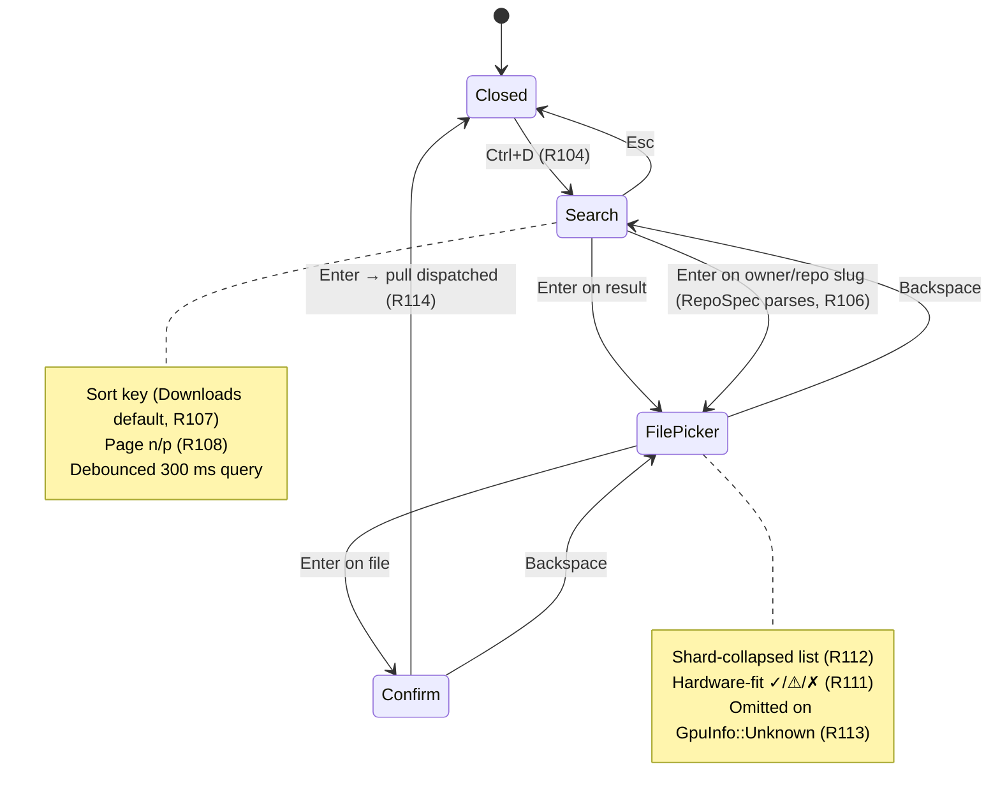

> **2026-05-21 update.** The friendly-display-name slice (R118 / R119 /
> R120) was dropped from this PR after review — real catalogs use
> well-named GGUFs, so `file_stem` is fine for now. The plan below still
> describes the original two-feature bundle for historical context; only
> the dialog + download strip + `vram_fit_for_file` helper landed. The
> dialog hotkey also moved from `Ctrl+D` to `Shift+D` so terminals that
> swallow `Ctrl+D` as EOF still work.

# HuggingFace Pull TUI Dialog (Search / Sort / Pagination)

## Overview

Add an in-TUI HuggingFace search-and-pull dialog (`Ctrl+D`) so users can
discover and download new GGUFs without leaving the terminal or
knowing a repo slug. Ships in the same slice as a derived friendly
display name (`<repo-basename> (<quant>)`) for HF-cache models so the
new dialog populates a list pane that no longer prints
`model.gguf`-style stems.

The dialog is a three-state modal overlay (Search → File picker →
Confirm). Search hits the HuggingFace Hub `/api/models` endpoint
through the existing `FetchClient` (R65's `FetchClient` carve-out for
hf-hub stays; the new metadata calls are pure JSON, so they ride the
v2 fetch contract). Per-repo file listing and the download itself
keep using `hf-hub` via the existing `download_repo` primitive — no
second downloader is introduced. Active downloads render in a pinned
single-line status strip placed between the host/info row and the
body.

## Problem Frame

Two papercuts ship together because they're cohesive at the user
level:

1. **Discovery friction.** The v1+v2 surface for adding a model is
   "alt-tab to the HuggingFace web, find a repo, copy the slug, run
   `llamastash pull owner/repo`." The R65 pull primitive handles the
   slug-known path, but the user who knows only the *shape* of what
   they want (a 7B coder, a small embed model) still leaves the TUI.
2. **Scannability friction.** Once a file lands, the TUI's
   `display_name(m) = file_stem(m.path)` produces `model.gguf` /
   `ggml-model-q4_k_m.gguf` rows for repos that publish ambiguously
   named files. Two `model.gguf` rows from different repos are
   indistinguishable without inspecting the parent path.

The dialog solves (1); the derived display name solves (2). Shipping
them together is the smallest meaningful slice — the dialog's Confirm
state previews the resolved display name, so the rename gives the
dialog something concrete to show on its last step (see origin: §Key
Decisions "One bundled feature, not two").

## Requirements Trace

Brainstorm IDs continue from R103. Every plan unit cites the
requirements it advances.

- **R104.** `Ctrl+D` opens the dialog from anywhere; `Esc` closes.
  Wired into existing keybinding + help-overlay tables.
- **R105.** Three-state modal: Search → File picker → Confirm.
  Backspace goes back; Esc closes from Search.
- **R106.** Search input as primary control; typing an
  `<owner>/<repo>` slug + Enter bypasses search and jumps to File
  picker (preserves the R65 "I know the slug" path).
- **R107.** Sort options: Downloads (default), Likes, Recently
  Updated, Trending. Cycle-key control; changing sort re-issues from
  page 1.
- **R108.** Page-by-page pagination (target page size 20). `n`/`p`
  navigate; `page X / Y` when total known, otherwise `page X` with a
  next affordance hidden when the previous fetch under-filled.
- **R109.** Result rows show repo slug, short description
  (`pipeline_tag` from the HF model object), and sort-relevant
  metric.
- **R110.** Filter chips out of scope for this slice — search + sort
  only.
- **R111.** File picker drills into the chosen repo's `.gguf` files;
  rows show filename, quant label, file size, and a ✓/⚠/✗ hardware-fit
  indicator computed from the recommender's VRAM-fit math (R55).
- **R112.** Split-shard sets (`*-NNNNN-of-MMMMM.gguf`) collapse into
  one logical row whose size is the sum; selecting it pulls the full
  shard set.
- **R113.** `GpuInfo::Unknown` (Vulkan-only fallback) omits the fit
  indicator rather than showing a fake confidence value.
- **R114.** Confirm dispatches the same `hf-hub`-backed primitive used
  by `llamastash pull` and the init wizard's model step (R65). No new
  download path.
- **R115.** Active downloads render in a pinned single-line status
  strip (resolved during planning to "below info row, above body" —
  see [Key Technical Decisions](#key-technical-decisions); the
  brainstorm's "above the global help bar" framing referenced a
  bottom strip that doesn't exist in the current kdash-style layout).
  Strip shows display name, bytes / total, percent, throughput. One
  pull's progress visible at a time; further pulls FIFO.
- **R116.** Already-cached file: short-circuit to a one-shot toast +
  select the corresponding row in the main list pane. No re-pull
  prompt.
- **R117.** Download failure: one-line error in the strip; full
  diagnostics flow to logs (R30). No auto-retry.
- **R118.** TUI display name for any model whose path matches the HF
  cache layout becomes `<repo-basename> (<quant>)`. Derived per-render,
  not stored.
- **R119.** Non-HF sources (Ollama / LM Studio / UserPath) keep their
  existing `file_stem` display name. Source-aware via path inspection.
- **R120.** Derived label replaces `file_stem` at every TUI render
  site (audit landed during research; see [Render-site audit](#render-site-audit)).

## Scope Boundaries

Preserved verbatim from the origin (see origin:
`docs/brainstorms/2026-05-20-hf-pull-tui-dialog-requirements.md` §Scope
Boundaries).

- **Out:** User-editable model aliases (no rename hotkey, no stored
  alias map). The derived label is what users live with.
- **Out:** Filter chips beyond search + sort.
- **Out:** Infinite scroll / lazy loading.
- **Out:** Multi-select / batch pull from the dialog.
- **Out:** Bespoke resume UI beyond `hf-hub`'s native resume.
- **Out:** In-TUI auth UI for private repos (`HF_TOKEN` env keeps
  working transparently).
- **Out:** Friendly names for non-HF sources.
- **Out:** HTTP / MCP browse surfaces (CLI `llamastash pull <slug>`
  stays the only non-TUI browse surface).
- **Out:** Modifying CLI `--json` shapes — `cli/output.rs::list_json`,
  `favorites_json`, and `CatalogRow::name()` continue to emit
  `file_stem` / `file_name` exactly as today (see [System-Wide Impact](#system-wide-impact)).

## Context & Research

### Relevant Code and Patterns

- `src/init/download.rs` — R65 pull primitive. Public entry points:
  - `RepoSpec::parse(raw) -> Result<RepoSpec, DownloadError>` parses
    `owner/repo[:filename]`, rejects path traversal. Reusable as-is
    for the slug-shortcut detection at R106.
  - `download_repo(spec, fetch, options).await -> Result<DownloadResult, DownloadError>`
    is the orchestrator. `DownloadOptions.progress: Option<Arc<dyn DownloadProgress>>`
    already exposes per-file events — the dialog wires its status strip
    through this without modifying the downloader.
  - `select_files` + `expand_shards` handle the sharded-pinned path so
    the picker can pin a logical (unsharded) base and still pull every
    shard.
- `src/init/fetch.rs` / `src/init/fetch_policy.rs` — `FetchClient`
  enforces HTTPS-only, host allowlist (per-redirect re-check),
  redirect cap (3), body-cap (streamed + Content-Length pre-check),
  offline mode (`LLAMASTASH_OFFLINE=1` / `--offline`). The
  `DEFAULT_ALLOWED_HOSTS` list already includes `huggingface.co` and
  the LFS / XET CDN hosts. `FetchClient::get_json<T>` is the natural
  call site for HF search JSON.
- `src/init/recommender.rs` — VRAM-fit math:
  - `estimate_peak_bytes(weights_bytes, ctx) -> u64` (public, MoE-naive
    fallback fine for the picker).
  - `effective_vram_ceiling(hw, snap) -> u64` (private; takes
    `HardwareSnapshot` + `BenchmarkSnapshot`). Per-backend overhead
    bands live in `snap.recommender_weights.overhead_band_bytes` keyed
    by `"cuda" / "hip" / "metal" / "vulkan" / "cpu"`.
  - The TUI doesn't carry a `HardwareSnapshot` today — it has
    `App.host_metrics: HostMetricsSnapshot` from the daemon sampler,
    which already exposes `gpu_backend`, `gpu_mem_total_bytes`, and
    `ram_total_bytes`. Plan adds a thin public helper that bypasses
    `HardwareSnapshot` and takes those primitives directly.
- `src/discovery/split_gguf.rs` — `parse_shard_name(name)`,
  `group(paths)` collapse shard sets. Pure functions over filenames;
  reusable on the in-memory `siblings` list returned by `hf-hub`.
- `src/util/paths.rs::model_display_name(&Path) -> String` — current
  canonical helper (file_stem fallback). Six call sites.
- `src/tui/list_pane.rs:330` — private `display_name(&DiscoveredModel) -> String`
  duplicates the file_stem path. To be folded into the canonical
  helper.
- `src/gguf/metadata.rs::Quant::label()` — canonical quant labels.
  `from_label` exists; no filename-based parser today.
- `src/tui/advanced_panel.rs` is the cleanest modal-overlay reference
  pattern: state struct on `App` as `Option<...>`, `Focus::AdvancedPanel`
  gate, per-focus key dispatcher in `events.rs::handle_advanced_input`.
- `src/tui/events.rs::apply_embed_submit` (L747-L767) is the canonical
  pattern for a TUI-spawned background task: `tokio::spawn(async move {...})`
  + `mpsc::unbounded_channel::<TabEvent>` + a `drain_*_pending` call at
  the top of the run loop. The HF dialog follows this shape exactly.
- `src/tui/render.rs::render` (L86-L131) — layout chunks: title
  (1) + info row (7, optional) + body. Overlays paint after the body.
- `src/tui/keybindings.rs` — `KeyMap`/`Focus`/`Action` table. New
  Focus variants and an `Action::OpenHfDialog` slot in here.

### Institutional Learnings

- `docs/spikes/2026-05-19-*.md` — the `hf-hub`-client-injection spike
  is the precedent for "let `hf-hub` keep its own `reqwest::Client`,
  route everything else through `FetchClient`." Plan reuses that
  carve-out; the search calls join the FetchClient side.
- `docs/plans/2026-05-18-001-feat-init-wizard-doctor-pull-plan.md` —
  established `FetchClient`, the offline branch, and `--features
  test-fixtures` integration tests. The dialog's offline branch (R73
  in origin: "search returns a clear offline message instead of
  hanging") reuses `FetchClient::is_offline()`.
- `docs/plans/2026-05-13-001-feat-llamatui-v1-launcher-plan.md` —
  Unit 6 (TUI shell) and Unit 7 (right-pane tabs) are the
  architecture this plan extends. The Confirm popup pattern from
  `confirm_overlay.rs` is the closest sibling for the dialog's
  Confirm state.

### External References

- HuggingFace Hub API model listing:
  `GET https://huggingface.co/api/models?search=<q>&filter=gguf&sort=<key>&limit=<n>` —
  documented at <https://huggingface.co/docs/hub/api>. Returns a JSON
  array of model objects with `id`, `downloads`, `likes`,
  `lastModified`, `pipeline_tag`, `tags`. Pagination is via the `Link`
  response header (`Link: <...&cursor=...>; rel="next"`) — verify the
  exact token shape in implementation Unit 3.

## Key Technical Decisions

- **Search + per-repo metadata routes through `FetchClient`;
  downloads stay on `hf-hub`.** The new endpoints return JSON
  metadata (≤ 1 MiB) so they fit the v2 fetch contract cleanly
  (redirect cap, body cap, host allowlist, offline branch). Downloads
  keep the established `hf-hub` carve-out. Net: one fewer reqwest
  client, the offline branch falls out for free, the host allowlist
  doesn't change.

- **Friendly display name derived from path alone, source detected by
  walking parents for `models--<owner>--<repo>`.** Keeps the existing
  `fn model_display_name(&Path) -> String` signature, so all six call
  sites (which today only have `&Path`) update without an API churn.
  No `ModelSource` argument required (the path is self-describing for
  HF-cache files).

- **Quant resolution prefers parsed GGUF metadata; filename heuristic
  is the fallback.** When `metadata.quant != Unknown`, the friendly
  label uses `metadata.quant.label()`. Otherwise a new
  `Quant::from_filename(name)` matches `*-Q4_K_M.gguf`-style suffixes
  (size-suffix tolerant: `_M`/`_S`/`_L` collapse to the K-quant).
  Unrecognised filenames render `(?)` and don't block the rename.
  (User choice during planning.)

- **Pinned status strip lives below the info row, above the body.**
  1-line constraint always present when active; absent when idle.
  Trade-off chosen over a "bottom of screen" placement because the
  current TUI has no bottom help bar — the global hint strip lives
  in the top accent row, so the strip would have nothing to anchor
  above at the bottom. The chosen position lets the strip ride the
  same accent edge as the title row and keeps the body uninterrupted.
  (User choice during planning.)

- **Debounced live search (~300 ms after the last keystroke).**
  Matches the HuggingFace web UI feel and means the user can refine
  by typing. Cancellation handled by tagging each in-flight request
  with a monotonic `query_seq` — the response handler drops results
  whose `seq` is stale.

- **File picker reuses `discovery::split_gguf::group` over the
  in-memory siblings list.** Same shard-collapse semantics as
  discovery; one place, one bug surface.

- **Single-flight download with a FIFO queue.** Only one pull's
  progress renders in the strip; subsequent confirms enqueue. Matches
  R115. Simplifies the render path (no multi-row strip).

- **Cache hit → toast + select row, no re-pull prompt.** R116. The
  brainstorm explicitly punts the "force re-pull" branch to "delete
  the file and pull again" — keeps the dialog's state machine small.

- **User-typed query is URL-encoded by `reqwest::Url::query_pairs_mut`;
  `Link`-header next URLs are re-validated against the fetch
  allowlist before following.** Free-text in the search input flows
  through `Url::query_pairs_mut().append_pair("search", q)` so
  special characters can't escape the query string. For pagination,
  the `Link` header's next URL is extracted, parsed with
  `reqwest::Url`, then re-validated via
  `fetch_policy::check_url(&parsed, &allowlist)` before the next
  request — the existing redirect-policy check covers redirects but
  not server-supplied next links, so this guard is explicit. As a
  defense-in-depth alternative, Unit 3 can extract only the `cursor`
  query parameter from the next URL and rebuild the request URL
  ourselves; pick during implementation.

- **Search calls are unauthenticated; private repos may surface in
  results but fail to pull.** The HF Hub `/api/models` search endpoint
  is public — the new search calls do *not* attach the bearer token
  (and the v2 fetch contract's "no opportunistic `Authorization`"
  rule says they must not). For a user with `HF_TOKEN` set, the
  download path (R65 / `hf-hub`) still picks up the token via the
  existing `resolve_hf_token` flow, so private repos they have access
  to download cleanly. Public search vs. token-gated download is
  fine in this slice; if a private repo appears in search results
  and pull fails with 401, the strip surfaces the error per R117
  and the user knows to file-paste a slug or check their auth. A
  future enhancement could opt-in to authenticated search behind a
  config flag; deferred.

## Open Questions

### Resolved During Planning

- **HF API endpoint shape (R106 / R107 / R108).** Resolved to
  `GET /api/models?search=<q>&filter=gguf&sort=<sort_key>&limit=20`.
  Sort keys: `downloads` (default), `likes`, `lastModified`,
  `trending`. Pagination via the `Link` response header
  (`rel="next"`). Per-repo file listing piggybacks on
  `hf_hub::Api::model(id).info().await` (already used in
  `download_repo`), which returns `siblings: Vec<{rfilename, size?}>`.
  Some `size` fields are `None` upstream — the picker shows `?` for
  those and surfaces the real size in the Confirm state after a HEAD
  probe via the existing `Api::metadata(url)` call (the downloader's
  HEAD pass moves earlier, into the picker).

- **FetchClient routing.** Resolved — see Key Technical Decisions.

- **Per-result short description source.** Resolved — `pipeline_tag`
  from the model object (e.g. `text-generation`, `text-embedding`).
  Skips the heavier `?full=true` payload. Falls back to empty when
  absent.

- **Render-site audit (R118 / R120).** Resolved — see
  [Render-site audit](#render-site-audit) below. Six call sites of
  `model_display_name(&Path)` + one private duplicate in
  `list_pane.rs` + the `path` cell on `list_pane::ListRow::Model`.
  CLI JSON shapes are explicitly out of scope.

- **Status strip layout (R115).** Resolved — see Key Technical
  Decisions and the [Render layout](#render-layout) sketch.

- **Quant-from-filename coverage.** Resolved — see Key Technical
  Decisions. New helper `Quant::from_filename`. GGUF header parsing
  on download remains the canonical post-download source.

### Deferred to Implementation

- **HF cursor token shape.** The `Link` header carries the next-page
  URL; the planning spike's assumption is cursor-based. If HF Hub
  surprises us with skip/limit instead, the pagination implementation
  swaps without touching the rest of the dialog. Confirm with a
  one-off probe in Unit 3.

- **`trending` sort key parity.** HF Hub's web UI labels are
  `Most downloads / Most likes / Recently updated / Trending`. The
  `sort=trending` API token is conventional but unverified in the
  v2 docs — implement Unit 3 probing what the API accepts and adjust
  the four-mode mapping if the token differs.

- **Search cancellation race.** The plan uses a `query_seq` counter
  to drop stale responses; the exact cancellation semantics in the
  presence of network in-flight reqs land in Unit 4's implementation.

- **`hf-hub::Sibling::size` availability.** The implementation
  verifies whether `RepoInfo::siblings[].size` ships on the wire
  consistently. If sizes are typically absent, the picker either
  fans out HEAD probes at picker-open time (≤ 20 files) or shows
  size only on the Confirm state.

## High-Level Technical Design

> *This illustrates the intended approach and is directional guidance
> for review, not implementation specification. The implementing
> agent should treat it as context, not code to reproduce.*

### Dialog state machine



### Module ownership

```
src/tui/hf_dialog.rs                 ← Unit 4 — state struct + render
src/tui/download_strip.rs            ← Unit 6 — pinned strip state + render
src/init/hf_api.rs                   ← Unit 3 — search + per-repo listing
src/gguf/metadata.rs                 ← Unit 1 — Quant::from_filename
src/util/paths.rs                    ← Unit 2 — friendly model_display_name
src/init/recommender.rs              ← Unit 5 — public vram_fit_for_file
```

### Endpoint sketch (illustrative, not literal)

```http
GET /api/models?search=qwen+coder&filter=gguf&sort=downloads&limit=20 HTTP/1.1
Host: huggingface.co
Accept: application/json
User-Agent: llamastash/0.0.1

# Response (truncated):
[
  { "id": "Qwen/Qwen2.5-Coder-7B-Instruct-GGUF",
    "downloads": 1234567, "likes": 4321,
    "lastModified": "2026-04-18T...", "pipeline_tag": "text-generation",
    "tags": ["gguf","qwen","coder"] },
  ...
]
Link: <https://huggingface.co/api/models?...&cursor=...>; rel="next"
```

### Friendly-name derivation (Unit 2)

```
parent path: ~/.cache/huggingface/hub/models--Qwen--Qwen2.5-7B-Instruct-GGUF/snapshots/abc123/
                                       └─────────── walk up ────────────┘
       repo:                            Qwen2.5-7B-Instruct-GGUF
       quant: metadata.quant.label()   →  "Q4_K"  (or filename fallback)
       label:                           "Qwen2.5-7B-Instruct-GGUF (Q4_K)"
```

When no `models--<owner>--<repo>` segment is found, the helper falls
back to `path.file_stem()` (existing behavior preserved for non-HF
sources, R119).

### Render layout

```
┌───────────────────────────────────────────────────────────┐
│ LlamaStash v0.1 · ●daemon · ?:help t:theme /:filter q:quit │  ← title row (1)
├───────────────────────────────────────────────────────────┤
│ Host         │ Daemon info               │ Logo            │  ← info row (7, optional)
├───────────────────────────────────────────────────────────┤
│ ⬇ Qwen2.5-7B-Instruct-GGUF (Q4_K)  70%  4.3/6.1 GB · 12 MB/s│  ← pinned strip (1, when active)
├───────────────────────────────────────────────────────────┤
│ Models                  │ Right pane                       │
│   ...                   │   ...                            │
│                         │                                  │
└───────────────────────────────────────────────────────────┘
```

The dialog itself paints as a centred modal overlay before the
help-overlay and confirm-overlay layers (matches the existing
overlay order in `render::render`).

## Implementation Units

- [x] **Unit 1: Filename quant heuristic**

  **Goal:** Provide a filename-based `Quant` parser so the new dialog's
  file picker and the friendly-name fallback can label remote /
  unparsed `.gguf` files with their quant.

  **Requirements:** R111, R118.

  **Dependencies:** None.

  **Files:**
  - Modify: `src/gguf/metadata.rs` — add `pub fn from_filename(name: &str) -> Option<Quant>`.
  - Test: inline `#[cfg(test)] mod tests` in `src/gguf/metadata.rs`.

  **Approach:**
  - Uppercase the filename stem; scan for the longest matching label
    from `Quant::all()` (the existing enum-walk in `from_label`),
    tolerating trailing `_M` / `_S` / `_L` K-quant size suffixes
    (which collapse to the base K-quant — `Q4_K_M` → `Q4_K`,
    `Q5_K_S` → `Q5_K`).
  - Word-boundary aware: only match between separators (`-`, `_`,
    `.`) so a filename like `embedder.gguf` doesn't accidentally
    match the inner `I` of any IQ-quant.
  - Returns `None` when no recognised label appears.

  **Patterns to follow:**
  - `Quant::from_label` (same file) — already walks the enum
    variants. Extend that walk pattern.

  **Test scenarios:**
  - Happy path: `Qwen2.5-7B-Instruct-Q4_K_M.gguf` → `Some(Quant::Q4_K)`.
  - Happy path: `model-iq3_xs.gguf` (lowercase) → `Some(Quant::IQ3_XS)`.
  - Happy path: `weights-Q8_0.gguf` → `Some(Quant::Q8_0)`.
  - Happy path: `ggml-model-f16.gguf` → `Some(Quant::F16)`.
  - Edge case: K-quant size suffix collapse — `*-Q5_K_L.gguf` → `Some(Quant::Q5_K)`.
  - Edge case: ambiguous filename — `model.gguf` → `None`.
  - Edge case: no extension — `Qwen2.5-7B-Q4_K` → `Some(Quant::Q4_K)`.
  - Error path: empty input → `None`.
  - Error path: filename whose only quant-looking substring is inside
    a longer word (e.g. `inquant.gguf`) → `None` (word-boundary
    rejected).

  **Verification:**
  - All test scenarios pass under `cargo test --features test-fixtures`.
  - No clippy warnings.

- [x] **Unit 2: Friendly display-name helper + render-site refactor**

  **Goal:** Replace `model_display_name(&Path)` and
  `list_pane::display_name(&DiscoveredModel)` with a single source-aware
  helper that produces `<repo> (<quant>)` for HF-cache models and
  preserves `file_stem` for everything else.

  **Requirements:** R118, R119, R120.

  **Dependencies:** Unit 1.

  **Files:**
  - Modify: `src/util/paths.rs` — extend `model_display_name`
    signature to accept an optional `metadata: Option<&ModelMetadata>`;
    walk parents to detect the `models--<owner>--<repo>` segment;
    when found, return `"<repo> (<quant>)"` with quant from
    metadata if present, else `Quant::from_filename(file_stem)` from
    Unit 1, else `(?)`.
  - Modify: `src/tui/list_pane.rs` — delete the private
    `fn display_name(&DiscoveredModel) -> String`; call the new
    helper at L238, L264, L357.
  - Modify: `src/tui/events.rs` — six call sites (L576, L738, L756,
    L812, L938, L996). Each has access to either a `ManagedRow`
    (whose path is enough for HF detection — metadata not always
    present, picker still works) or a `DiscoveredModel` (metadata is
    `Some` for most).
  - Modify: `src/tui/info_pane.rs:203` — `model_display_name(&managed.path)`
    callsite gains the optional metadata.
  - Modify: `src/tui/right_pane.rs` — four call sites (L318, L320,
    L400, L407).
  - Test: inline tests in `src/util/paths.rs` for the helper itself;
    integration test under `tests/tui_render.rs` (or new file) that
    asserts the rendered list pane shows `Qwen2.5-7B-Instruct-GGUF
    (Q4_K)` for an HF-cache `DiscoveredModel` fixture.

  **Approach:**
  - The helper does not require `ModelSource` — it derives HF-ness
    purely from the path's parent chain. Concretely: walk
    `path.ancestors()`; if any segment starts with `models--`, take
    the segment, strip `models--<owner>--` to extract `<repo>`. This
    works for both the canonical HF snapshot layout and any
    user-symlinked variant that preserves the `models--*` directory.
  - When two HF-cache models live in different owners (e.g.
    `models--Qwen--Qwen2.5-7B` vs `models--bartowski--Qwen2.5-7B`),
    they currently print the same `<repo>` but the parent paths
    differ so they remain visually distinct via the folder grouping
    (existing list-pane behavior). Acceptable for this slice; can be
    extended to `<owner>/<repo> (<quant>)` if duplicate-owner
    confusion becomes a problem.
  - **Atomic-commit constraint.** Extending `model_display_name`'s
    signature touches every existing caller in the same change. Land
    Unit 2 as one commit — a half-applied refactor leaves the build
    broken because callers can't pass the new metadata argument
    incrementally. If the atomic landing is too noisy for review, an
    alternative is to keep the old `model_display_name(&Path)`
    signature and add a sibling `model_display_name_with(&Path,
    Option<&ModelMetadata>)` so the rename happens callsite-by-
    callsite — pick during implementation but flag the choice in
    the PR description.

  **Patterns to follow:**
  - The existing `crate::init::download::repo_folder_name(repo_id)`
    is the inverse — `<owner>/<repo>` → `models--<owner>--<repo>`.
    Mirror that parsing direction.

  **Test scenarios:**
  - Happy path: HF-cache path
    `/home/u/.cache/huggingface/hub/models--Qwen--Qwen2.5-7B-Instruct-GGUF/snapshots/abc/qwen.gguf`
    + metadata with `Quant::Q4_K` → `"Qwen2.5-7B-Instruct-GGUF (Q4_K)"`.
  - Happy path: HF-cache path, no metadata, filename
    `*-Q5_K_M.gguf` → `"<repo> (Q5_K)"` via Unit 1 fallback.
  - Edge case: HF-cache path, no metadata, ambiguous filename
    `model.gguf` → `"<repo> (?)"`.
  - Edge case: Non-HF path (`/models/local/Llama-3.gguf`) → `"Llama-3"`
    (file_stem fallback, R119).
  - Edge case: Ollama path
    (`~/.ollama/models/manifests/registry.ollama.ai/library/llama3/latest`)
    → file_stem fallback.
  - Edge case: HF cache path with deeply nested snapshot
    (`.../models--owner--repo/snapshots/rev/sub/dir/file.gguf`) →
    parent walk still finds the `models--` segment.
  - Edge case: HF-cache layout missing the snapshots intermediate
    (synthetic test fixture) → still extracts `<repo>` so users
    pointing `--model-path` at a flat copy of HF blobs still get the
    friendly name.
  - Integration: rendered list pane snapshot shows the friendly name
    in the Name column for an HF-cache fixture.
  - Integration: rendered right-pane title shows the friendly name
    for an HF-cache running launch.

  **Verification:**
  - All six `model_display_name` call sites in `events.rs` resolve
    against the new signature.
  - `cargo test --features test-fixtures` passes.
  - Manual smoke (against a populated HF cache): `cargo run` shows
    HF rows as `<repo> (<quant>)` and non-HF rows unchanged.

- [x] **Unit 3: HF Hub API client (search + per-repo metadata)**

  **Goal:** A typed client that issues `/api/models` searches and
  per-repo listings through `FetchClient`, with cursor-based
  pagination and offline propagation.

  **Requirements:** R106, R107, R108, R109.

  **Dependencies:** None (sits on `FetchClient`).

  **Files:**
  - Create: `src/init/hf_api.rs` — new module with:
    - `pub struct HfSearchResult { repo_id, downloads, likes, last_modified, pipeline_tag, tags }`
    - `pub enum HfSortKey { Downloads, Likes, RecentlyUpdated, Trending }` with `as_query_token()`.
    - `pub struct HfSearchPage { results: Vec<HfSearchResult>, next_cursor: Option<String> }`
    - `pub async fn search(fetch: &FetchClient, query: &str, sort: HfSortKey, cursor: Option<&str>) -> Result<HfSearchPage, FetchError>`
    - `pub struct HfRepoFile { filename, size_bytes: Option<u64> }`
    - `pub async fn list_repo_files(fetch: &FetchClient, repo_id: &str) -> Result<Vec<HfRepoFile>, ...>`
      — backed by `hf_hub::Api::model(id).info()` for parity with
      `download_repo`. Reuses the existing hf-hub `Api` build path
      (no second client) so we don't duplicate the bearer-token
      plumbing.
  - Modify: `src/init/mod.rs` — `pub mod hf_api;`.
  - Test: inline `#[cfg(test)] mod tests` in `src/init/hf_api.rs`.

  **Approach:**
  - The endpoint base is `crate::init::download::endpoint()` so an
    `HF_ENDPOINT` override (already vetted against
    `HF_HOST_ALLOWLIST`) flows through.
  - Body cap: 1 MiB for search results (well above 20 model objects),
    256 KiB for per-repo file listing. Passed to `get_json`.
  - The `Link` header is read off the raw response — since
    `FetchClient::get_json` currently consumes the response, this
    plan extends `FetchClient` with a sibling
    `pub async fn get_json_with_headers<T>(&self, url, max_bytes) -> Result<(T, http::HeaderMap), FetchError>`
    or refactors `get_json` to return both. Mid-scope refactor; one
    method signature touched.
  - The `cursor` field is opaque — `next_cursor` is whatever the next
    URL says. The dialog stores the cursor as a `String` and passes
    it back on `n` to fetch the next page.
  - When `FetchClient::is_offline()` is true, both `search` and
    `list_repo_files` short-circuit with `FetchError::Offline` before
    issuing any request, so the dialog's offline branch (R73 in
    origin §Success Criteria) gets a clear typed error rather than a
    timeout.

  **Patterns to follow:**
  - `src/init/snapshot.rs` and `src/init/benchmark.rs` for
    `FetchClient::get_json` usage (caps + deserialisation patterns).
  - `src/init/download.rs::endpoint()` for HF endpoint resolution.

  **Test scenarios:**
  - Happy path: `HfSortKey::Downloads.as_query_token()` → `"downloads"`
    (and equivalents for Likes/RecentlyUpdated/Trending).
  - Happy path: search response deserialises into `HfSearchResult`
    correctly given a recorded JSON fixture (e.g. saved sample of
    `?search=qwen&filter=gguf`).
  - Edge case: response with no `pipeline_tag` field → `result.pipeline_tag = None`.
  - Edge case: response with no `Link` header → `next_cursor: None`.
  - Edge case: response with a `Link` header that has only
    `rel="prev"` → `next_cursor: None`.
  - Error path: `fetch.is_offline()` → `FetchError::Offline`.
  - Error path: host not on allowlist (synthetic call to an unrelated
    URL) → `FetchError::HostNotAllowed`.
  - Error path: body exceeds cap → `FetchError::BodyOverflow`.
  - Error path: `Link` header next URL points to a non-allowlisted
    host → refused via `check_url`, `next_cursor` returns `None`
    (defense against a server-supplied pagination URL trying to
    escape the allowlist).
  - Error path: user-typed search containing `&` / `=` / Unicode
    characters survives a round-trip — the request URL is correctly
    escaped and the server sees the original query.
  - Refactor: `FetchClient::get_json_with_headers<T>` returns both
    the deserialised body AND `http::HeaderMap`; body cap still
    enforced via the same streaming path as `get_json`.
  - Integration: `list_repo_files` against a recorded
    `Qwen/Qwen2.5-7B-Instruct-GGUF` fixture surfaces sibling list with
    sizes (where present).

  **Verification:**
  - Cargo build under `default-features` + `test-fixtures` passes.
  - Unit tests pass under `cargo test --features test-fixtures`.
  - No network traffic in tests — every external response is a fixture.

- [x] **Unit 4: HF dialog state machine + render**

  **Goal:** A modal overlay that owns the Search → File picker →
  Confirm state machine and renders into a centred modal.

  **Requirements:** R104, R105, R106, R107, R108, R109.

  **Dependencies:** Units 1, 2, 3.

  **Files:**
  - Create: `src/tui/hf_dialog.rs` — `HfDialogState { stage, query, sort, cursor, page, results, selected, repo_files, picker_selected, ... }`, plus `enum HfStage { Search, FilePicker, Confirm }`, plus `pub fn render(frame, area, state, app, palette)`.
  - Modify: `src/tui/app.rs` — add `pub hf_dialog: Option<HfDialogState>` field on `App`; `pub fn open_hf_dialog(&mut self)`, `close_hf_dialog`.
  - Modify: `src/tui/keybindings.rs` — add `Action::OpenHfDialog`,
    bind to `Ctrl+D` in `LIST_BINDINGS`; new `Focus::HfDialog` variant
    + per-focus binding table (arrows, n/p for paging, sort cycle,
    Enter/Esc/Backspace).
  - Modify: `src/tui/events.rs` — add `pump_input` branch for
    `Focus::HfDialog`; handle keystrokes (typing extends the query
    buffer, schedules a debounced dispatch); add `HfDialogEvent` enum
    + `drain_hf_dialog(app)` mirroring `drain_embed_pending` shape;
    `tokio::spawn` async tasks that call `hf_api::search` /
    `hf_api::list_repo_files` and send results back via an
    `mpsc::unbounded_channel<HfDialogEvent>` stored on the dialog
    state.
  - Modify: `src/tui/render.rs` — paint the dialog after the body and
    before `help_overlay` / `confirm_overlay`.
  - Modify: `src/tui/mod.rs` — `pub mod hf_dialog;`.
  - Test: inline tests in `src/tui/hf_dialog.rs` for state transitions;
    integration test in `tests/hf_dialog_integration.rs` for the
    render snapshot (using `ratatui::Terminal` + the existing test
    harness).

  **Approach:**
  - Debounced search: each keystroke updates `query_buffer` +
    `query_seq += 1` + records the wallclock instant. The drain at
    the top of the loop checks "300 ms elapsed since last keystroke
    and `query_seq > last_dispatched_seq`" → spawn the request,
    stamping the spawned task with the current `query_seq`. Responses
    that come back with a stale `seq` are dropped.
  - Slug-shortcut: on Enter in the Search state, run
    `RepoSpec::parse(query_buffer)`; on `Ok`, transition straight to
    File picker for that repo.
  - Sort key cycle: a single binding (`o` or `Tab` — see Unit 7) walks
    through `Downloads → Likes → RecentlyUpdated → Trending` and
    re-issues the query at page 1.
  - Result row width math mirrors `list_pane.rs::cell` so columns
    truncate cleanly.

  **Technical design** (non-obvious dispatch wiring; directional only):

  ```
  Input loop                Run loop                    Background task
  ─────────────             ────────────                ───────────────
  key 'q'  ─┐                                            
  key 'w'  ─┤ updates       drain_hf_dialog:
  key 'e'  ─┤ query_buffer  if elapsed >= 300ms       ──▶ tokio::spawn
  key 'n'  ─┘ + query_seq      && seq > last_seq            hf_api::search(...)
                              last_seq := seq                   │
                                                                ▼
                            drain_hf_dialog:           ◀── tx.send(HfDialogEvent
                              while let Ok(evt) =        ::SearchResults { seq, page })
                                rx.try_recv() { ... }
                              if evt.seq < query_seq:
                                drop (stale)
                              else: apply to state
  ```

  **Patterns to follow:**
  - `src/tui/advanced_panel.rs` — modal state struct + centred render.
  - `src/tui/events.rs::apply_embed_submit` (L747-L767) — spawn +
    mpsc + drain pattern.

  **Test scenarios:**
  - Happy path: state transitions `Closed → Search → FilePicker →
    Confirm → Closed` on Ctrl+D / Enter / Enter / Enter.
  - Happy path: sort cycle: starting at `Downloads`, pressing the
    sort-cycle key four times returns to `Downloads`.
  - Happy path: typing `owner/repo` + Enter in Search bypasses
    search and transitions to FilePicker with the parsed `RepoSpec`.
  - Edge case: Esc from Search closes the dialog; Backspace from
    FilePicker returns to Search (preserves the query buffer);
    Backspace from Confirm returns to FilePicker.
  - Edge case: stale response — the dialog drops a response whose
    `seq` is below the current `query_seq`.
  - Edge case: offline (`LLAMASTASH_OFFLINE=1`) — search returns an
    error state with an "offline — paste a repo ID …" message; user
    can still type a slug + Enter to bypass.
  - Edge case: empty query → no request fired (debounce never
    dispatches an empty search).
  - Error path: `HfApi::search` returns `FetchError::RateLimited` →
    the dialog renders a one-line error and keeps the existing
    results visible.
  - Error path: search response has zero results → dialog renders
    "no matches" and the page indicator hides.
  - Integration: ratatui terminal snapshot of the dialog in each of
    Search, FilePicker, and Confirm states.

  **Verification:**
  - `cargo test --features test-fixtures hf_dialog` passes.
  - Manual smoke: Ctrl+D opens the dialog; typing fires a search;
    arrow keys move; Enter drills down.

- [x] **Unit 5: File picker — shard collapse + hardware-fit indicator**

  **Goal:** Render the chosen repo's `.gguf` files with size,
  quant, and a ✓/⚠/✗/— fit indicator. Group shard sets.

  **Requirements:** R111, R112, R113.

  **Dependencies:** Units 3, 4. Also depends on Unit 1 (filename
  quant) for labelling each row.

  **Files:**
  - Modify: `src/init/recommender.rs` — add public helper
    `pub fn vram_fit_for_file(file_size_bytes: u64, ctx: u32, backend: &str, vram_bytes: Option<u64>, ram_total_bytes: u64, overhead_band_bytes: Option<u64>) -> FileFit`
    where `pub enum FileFit { Fit, Tight, Over, Unknown }`. `Tight`
    is between 85% and 100% of the ceiling; `Fit` is below 85%; `Over`
    above 100%; `Unknown` when backend is `"unknown"` or VRAM is
    `None` and the helper can't compute (R113).
  - Modify: `src/tui/hf_dialog.rs` — File picker renderer reads
    `app.host_metrics.{gpu_backend, gpu_mem_total_bytes, ram_total_bytes}`,
    loads the per-backend overhead band from the bundled benchmark
    snapshot (already loaded by init; expose via `App` if necessary
    or read on-demand), and computes the fit per row.
  - Modify: `src/tui/hf_dialog.rs` — apply `discovery::split_gguf::group`
    over the `Vec<HfRepoFile>` filenames so shard sets collapse into
    one row whose `size_bytes` is the sum.
  - Test: inline tests in `src/init/recommender.rs` for
    `vram_fit_for_file`; inline tests in `src/tui/hf_dialog.rs` for
    the shard-collapse step.

  **Approach:**
  - The picker pre-selects the "best fit" row: largest `Fit` whose
    quant outranks the next-larger `Tight` etc. — a simple rank.
    Arrow keys override.
  - Overhead band lookup mirrors `effective_vram_ceiling` —
    same string keys (`"cuda"`/`"hip"`/`"metal"`/`"vulkan"`/`"cpu"`).
    The helper accepts the band as an `Option<u64>` so it stays
    pure-functional and the snapshot lookup happens at the caller.
  - `ctx` for the fit estimate is `recommender::DEFAULT_CTX` (16k) —
    matches the init recommender's evaluation cadence so the picker
    and the recommender agree.

  **Patterns to follow:**
  - `src/init/recommender.rs::estimate_peak_bytes` /
    `effective_vram_ceiling` for the math (public + private,
    respectively).
  - `src/discovery/split_gguf.rs::group` for shard-collapse semantics.

  **Test scenarios:**
  - Happy path: 6 GiB file on a 24 GiB CUDA host with 512 MiB
    overhead → `FileFit::Fit`.
  - Happy path: 20 GiB file on a 24 GiB CUDA host with 512 MiB
    overhead → `FileFit::Tight` (close to the 85% threshold).
  - Happy path: 30 GiB file on a 24 GiB CUDA host → `FileFit::Over`.
  - Edge case: `backend = "unknown"` (Vulkan-only, R113) →
    `FileFit::Unknown` regardless of size.
  - Edge case: `backend = "cpu_only"`, `vram_bytes = None`,
    `ram_total_bytes = 16 GiB` → falls back to RAM gating
    (50% of RAM = 8 GiB ceiling).
  - Edge case: shard collapse — `[*-00001-of-00005.gguf, ..., *-00005-of-00005.gguf]`
    + 5 unrelated files → one Split entry whose size = sum of
    shards + the 5 originals as Single entries.
  - Edge case: shard set missing siblings (`-00001-of-00005` and
    `-00002-of-00005` but no others) → Split with `complete: false`;
    File picker greys the row so the user can't pick a half-set.
  - Error path: `vram_bytes = None`, `ram_total_bytes = 0` → the
    helper returns `FileFit::Unknown` rather than dividing.

  **Verification:**
  - `cargo test --features test-fixtures recommender::tests` and
    `hf_dialog::tests` pass.

- [x] **Unit 6: Pull orchestration + pinned download strip**

  **Goal:** Confirm dispatches a background download via the existing
  R65 primitive, and a pinned status strip renders progress between
  the info row and the body.

  **Requirements:** R114, R115, R116, R117.

  **Dependencies:** Units 2 (friendly names in the strip label), 4, 5.

  **Files:**
  - Create: `src/tui/download_strip.rs` — `DownloadStripState { queue: VecDeque<QueuedPull>, active: Option<ActivePull>, last_error: Option<String> }`, `pub fn render(frame, area, state, palette)`. Active rendering shows the model's friendly display name, bytes/total, percent, throughput.
  - Modify: `src/tui/app.rs` — add `pub download_strip: DownloadStripState` field on `App`; getter `pub fn download_strip_active(&self) -> bool`.
  - Modify: `src/tui/render.rs::render` — layout change: when
    `app.download_strip_active()` is true, insert a 1-line constraint
    between the info row and the body. Always reserved; absent when
    inactive.
  - Modify: `src/tui/events.rs` — add `DownloadEvent` enum
    (`Started`, `Progress { bytes, total, throughput_bps }`, `Finished`, `Error`, `AlreadyCached`); a `mpsc::UnboundedSender<DownloadEvent>` stored on `App`; a `drain_download_strip(app)` in the run loop; a `spawn_download_task(spec, fetch, sender)` helper that calls `crate::init::download::download_repo` with a `DownloadProgress` implementation that ships events.
  - Modify: `src/tui/hf_dialog.rs` — `Confirm` action enqueues a
    `QueuedPull` on the strip's FIFO and dispatches the next pull
    when no `active` exists; cache-hit short-circuit (R116) checks
    for `<hf_cache>/models--<owner>--<repo>/snapshots/<sha>/<file>`
    existence + size before dispatch and emits
    `DownloadEvent::AlreadyCached` immediately, which the strip handler
    converts into a toast + selects the matching list-pane row.
  - Test: inline tests in `src/tui/download_strip.rs` for state
    transitions; integration test in `tests/hf_dialog_integration.rs`
    exercising a download via a `DownloadProgress` fake that emits
    canned events.

  **Approach:**
  - A `DownloadProgress` impl on the TUI side is a thin shim that
    forwards every `on_file_*` callback into the
    `mpsc::UnboundedSender<DownloadEvent>`. Throughput is computed
    by sampling bytes-since-last-event vs. wallclock between events;
    smoothed by an EMA over the last 4 samples so the strip doesn't
    jitter.
  - The strip's display name uses the friendly helper from Unit 2;
    constructed against the *post-download* path which lands under
    `models--<owner>--<repo>/snapshots/<rev>/<file>` — so the strip
    label already reads `<repo> (<quant>)` mid-download.
  - Cache-hit detection: hf-hub's `Api::metadata(url)` HEAD already
    returns the `etag` / `commit_hash`; the existing
    `repo_folder_name` helper combined with the snapshot revision
    lets us probe the local path. Cheaper alternative: just call
    `repo.get(filename)` and let `hf-hub` skip the download when the
    blob matches — surface that "already there" via a synthetic
    `DownloadEvent::AlreadyCached` from the progress impl when
    `on_file_finished` fires within an unreasonable time (< 200 ms)
    for a non-trivial file size. Pick during implementation.
  - On `DownloadEvent::Error`, the strip clears active, surfaces a
    one-line error for ~5 s, then dequeues the next pull (R117).
  - FIFO queue is unbounded in this slice — multi-pull queueing is a
    minor edge case and capping is deferred until usage shows the
    need.

  **Patterns to follow:**
  - `src/init/download.rs::DownloadProgress` trait + the wizard's
    `cliclack`-backed implementation as the reference for the shim.
  - `src/tui/events.rs::drain_embed_pending` for the drain pattern.

  **Test scenarios:**
  - Happy path: `Confirm → Closed` enqueues a pull, `drain_download_strip`
    promotes it to active, `Started → Progress(50%) → Progress(100%) → Finished`
    sequence updates the strip; on `Finished` the strip queues the
    next pull (or hides if empty).
  - Happy path: two pulls in quick succession → second one waits in
    FIFO; first completes; strip transitions to second pull.
  - Edge case: `AlreadyCached` event renders a toast "already
    downloaded — selected in main list" and selects the matching
    `ListRow::Model` (path equality match).
  - Edge case: Error event renders "pull failed: <reason>" for ~5 s,
    then clears and dequeues the next pull.
  - Edge case: download active when the user opens the dialog and
    confirms a second pull → second pull enqueues, doesn't interrupt
    the active one.
  - Edge case: dialog closed mid-download → download continues; strip
    remains visible.
  - Edge case: multi-shard pull (5 shards × 3 GiB each) — strip's
    `total` reflects the sum from `on_files_resolved`; per-shard
    `on_file_started` / `on_file_finished` increments the
    `bytes_done` counter; throughput remains smooth across shard
    boundaries (no per-shard reset to 0%).
  - Error path: writer task drops the channel → `DownloadEvent::Error("writer offline")`
    surfaces and the strip clears.
  - Integration: ratatui terminal snapshot of the strip in `Active`
    state showing the friendly display name.

  **Verification:**
  - `cargo test --features test-fixtures download_strip` passes.
  - Manual smoke: confirm a small HF model from the dialog; strip
    appears, progress increments, model lands in the list pane with
    its friendly name.

- [x] **Unit 7: Keybindings, help overlay, scope-boundary docs**

  **Goal:** Surface `Ctrl+D` in the help overlay + AGENTS.md, finalise
  the per-Focus binding tables for the dialog, and sync the docs.

  **Requirements:** R104, R110 (the boundary doc states what's
  explicitly out).

  **Dependencies:** Unit 4 (the dialog has to exist before we wire
  help text into it).

  **Files:**
  - Modify: `src/tui/keybindings.rs` — confirm `Action::OpenHfDialog`
    is in the table from Unit 4; verify `Ctrl+D` is unique across
    LIST_BINDINGS and not shadowed in any sub-focus. Add per-stage
    sub-binding tables (Search, FilePicker, Confirm) wired through
    a `Focus::HfDialog` variant.
  - Modify: `src/tui/help_overlay.rs` — add a `Ctrl+D : open
    HuggingFace pull dialog` row in the global section; per-stage
    sub-sections describing the sort cycle, n/p paging, Enter/Esc/
    Backspace semantics.
  - Modify: `AGENTS.md` — under "Scope boundaries", note that the HF
    pull dialog is interactive-only (CLI `llamastash pull <slug>`
    stays the only non-TUI surface). Cross-reference this plan.
  - Modify: `README.md` — quickstart screenshot list / feature blurb
    adds a line for the dialog.
  - Modify: `docs/usage.md` — keybindings reference table adds
    `Ctrl+D`.
  - Modify: `docs/architecture.md` — module list adds `tui::hf_dialog`
    and `init::hf_api`.
  - Modify: `CHANGELOG.md` — `[Unreleased]` entry "Add in-TUI
    HuggingFace pull dialog (Ctrl+D) and friendly display names for
    HF-cached models."
  - Modify: `TODO.md` — strike the existing "HF pull TUI dialog" +
    "Friendly HF names" lines (both currently `[ ] **In progress**`)
    and replace with the shipped-once-merged completion entry.
  - Test: inline tests in `keybindings.rs` for the new bindings'
    presence + uniqueness; the existing snapshot tests should pick up
    the help-overlay copy.

  **Approach:**
  - `Ctrl+D` historically means EOF in some shells, but inside the
    raw-mode TUI it's a free keystroke. Confirm via grep that the
    binding isn't already shadowed (the LIST_BINDINGS in
    `keybindings.rs` shows no Ctrl+D today; safe).
  - The help-overlay copy mirrors the dialog's render labels so the
    user can map "what I see on screen" to "what the help says."

  **Test scenarios:**
  - Happy path: `LIST_BINDINGS` contains a `Ctrl+D → OpenHfDialog`
    entry; no other binding in any focus uses `Ctrl+D`.
  - Happy path: help overlay rendered snapshot includes the
    `Ctrl+D : pull from HuggingFace` row.
  - Edge case: per-focus binding tables have no key collisions within
    the dialog stages.
  - Test expectation: docs sync — none (string-grep tests are too
    brittle; docs sync is verified by the project-standards reviewer
    on the PR).

  **Verification:**
  - `cargo test keybindings` and `help_overlay` pass.
  - `AGENTS.md` / `README.md` / `docs/usage.md` /
    `docs/architecture.md` / `CHANGELOG.md` / `TODO.md` updated in
    the same PR.

## Render-site audit

Every TUI render site that calls `model_display_name` or the private
`list_pane::display_name`. CLI / IPC / log-file paths are explicitly
excluded — they continue to use `file_stem` / `file_name`.

| File | Line(s) | Call | Replace? |
|---|---|---|---|
| `src/util/paths.rs` | 44 | `pub fn model_display_name(path)` (canonical helper) | **Yes — extended** to take optional `&ModelMetadata` and emit friendly name for HF paths. Implementer may instead introduce a sibling `model_display_name_with(&Path, Option<&ModelMetadata>)` if the atomic-callsite rename is too noisy for one PR — see Unit 2 Approach. |
| `src/tui/list_pane.rs` | 304 | `running_row_stub` builds `name` from `file_stem` | Yes — call new helper |
| `src/tui/list_pane.rs` | 330 | private `fn display_name(&DiscoveredModel)` | **Delete** — folded into canonical helper |
| `src/tui/list_pane.rs` | 238, 264, 357 | call sites of the private helper | Yes — switch to canonical helper |
| `src/tui/events.rs` | 576, 738, 756, 812, 938, 996 | `model_display_name(&managed.path)` / `model_display_name(&path)` | Yes — pick up the extended signature; metadata passed via `app.models[..]` lookup |
| `src/tui/info_pane.rs` | 203 | `model_display_name(&m.path)` for running label | Yes |
| `src/tui/right_pane.rs` | 318, 320, 400, 407 | right-pane title + Settings "not launched" | Yes |
| `src/tui/confirm_overlay.rs` | (via `ConfirmAction::LaunchDuplicate.name`) | name pre-resolved in `events.rs:938` | Already covered above |
| `src/tui/help_overlay.rs` | n/a | no per-model name interpolation | No change |
| `src/cli/output.rs` | 96 (`favorites_json::name`) | `file_stem` projection into JSON | **No — keep stable** |
| `src/cli/resolve.rs::CatalogRow::name` | 43 | `file_name` for `list --json` | **No — keep stable** |
| `src/ipc/methods.rs` | 1175 (`build_log_path`) | `file_stem` for log filename | **No — internal** |

## System-Wide Impact

- **Interaction graph:** New `WriterCmd`-style channel
  (`HfDialogEvent` + `DownloadEvent`) feeds the existing run-loop
  drain pattern. The dialog itself sits beside the existing modal
  overlays (`AdvancedPanel`, `HelpOverlay`, `ConfirmOverlay`) — no
  changes to how those dispatch.
- **Error propagation:** Network errors surface inline (search bar
  error line, strip error line) and full diagnostics flow to the
  existing logs surface (R30). `FetchError::RateLimited` /
  `FetchError::HostNotAllowed` / `FetchError::Offline` already have
  typed variants — the dialog branches on them.
- **State lifecycle risks:** The pinned strip lives across dialog
  close → reopen cycles (its state lives on `App`, not on
  `HfDialogState`). A pull dispatched while the dialog was open keeps
  ticking after the user closes the dialog.
- **API surface parity:** CLI agents continue to use
  `llamastash pull <slug>` unchanged. The IPC dispatch table doesn't
  grow — the dialog is TUI-only. CLI `--json` shapes are explicitly
  byte-stable.
- **Integration coverage:** End-to-end test in
  `tests/hf_dialog_integration.rs` walks `Ctrl+D → search → drill into
  fixture repo → confirm → progress strip → friendly name lands in
  list pane`, using fake HF responses and a `DownloadProgress` shim.
- **Unchanged invariants:**
  - `llamastash pull <slug>` CLI behavior, exit codes, and `--json`
    shape.
  - `cli/output.rs::list_json` / `favorites_json` / `CatalogRow::name`
    JSON projections.
  - The IPC method surface (no new RPC).
  - The `hf-hub`-vs-`FetchClient` carve-out — downloads remain on
    `hf-hub`; only metadata calls join `FetchClient`.
  - `HF_TOKEN` / `HF_HOME` / `HF_ENDPOINT` env handling — the dialog
    inherits the existing resolution path in
    `init::download::{resolve_hf_token,endpoint,hf_cache_dir}`.

## Risks & Dependencies

| Risk | Mitigation |
|---|---|
| HF API endpoint shape doesn't match the planning-spike assumption (cursor vs. skip/limit; `trending` token spelling) | Unit 3 ships behind a one-off probe before scope-lock. Pagination is a single function — swapping cursor↔skip is contained. |
| HF rate-limiting trips users with rapid keystrokes | Debounce + cancellation drops most extra calls; `FetchClient::FetchError::RateLimited` is typed so the dialog can surface a graceful error line and back off. |
| Network call inside the render loop blocks the TUI | All network work runs on `tokio::spawn`d tasks; results flow back via mpsc; the run-loop drains non-blocking via `try_recv()`. No `.await` in the render path. |
| `hf-hub` re-resolves siblings without `size` fields, making the picker show `?` for sizes | The Confirm state always runs a HEAD probe (`Api::metadata`) before dispatching, so the user sees a real total + the disk precheck (R64) still fires. Sizes in the picker are a polish, not a correctness invariant. |
| Friendly name plumbing regresses non-HF model names | Unit 2's helper is path-only; for non-HF paths it returns identical `file_stem` output. Integration tests cover Ollama / LM Studio / UserPath fixtures. |
| Dialog opened on `LLAMASTASH_OFFLINE=1` hangs on the network call | `FetchClient::is_offline()` short-circuits before any request — the dialog renders the offline message immediately. Already covered by `FetchClient`'s tests; Unit 4 adds a dialog-level test. |
| Sort cycle key collides with a list-binding | Per-focus binding tables — the dialog's `Focus::HfDialog` variant gives the sort cycle its own keymap; the global list bindings are inactive while the dialog has focus. |

## Documentation / Operational Notes

- AGENTS.md "Scope boundaries" gets an updated bullet for the dialog
  (TUI-only; CLI surface unchanged).
- `docs/usage.md` keybinding table adds `Ctrl+D`.
- `docs/architecture.md` module list adds `src/tui/hf_dialog.rs`,
  `src/tui/download_strip.rs`, `src/init/hf_api.rs`.
- README quickstart gains a line about the dialog with an example
  search.
- CHANGELOG `[Unreleased]` gets one entry covering both the dialog
  and the friendly-name rename.
- TODO.md: strike the two existing `[ ] **In progress**` lines
  ("HuggingFace pull TUI dialog…", "Models downloaded from HF has
  cryptic names…") once this plan ships; add a follow-up entry for
  the deferred "friendly names for Ollama / LM Studio / UserPath
  sources" tracked from R119.

## Sources & References

- **Origin document:** [docs/brainstorms/2026-05-20-hf-pull-tui-dialog-requirements.md](../brainstorms/2026-05-20-hf-pull-tui-dialog-requirements.md)
- Related plans:
  - [docs/plans/2026-05-13-001-feat-llamatui-v1-launcher-plan.md](2026-05-13-001-feat-llamatui-v1-launcher-plan.md) — Unit 6/7 (TUI shell + right pane).
  - [docs/plans/2026-05-18-001-feat-init-wizard-doctor-pull-plan.md](2026-05-18-001-feat-init-wizard-doctor-pull-plan.md) — Unit 4/9 (FetchClient + R65 pull primitive).
  - [docs/plans/2026-05-20-001-feat-live-hf-snapshot-discovery-plan.md](2026-05-20-001-feat-live-hf-snapshot-discovery-plan.md) — adjacent live-HF surface; this plan reuses its FetchClient routing.
- Related code anchors:
  - `src/init/download.rs::{RepoSpec, download_repo, DownloadProgress}` — pull primitive + progress callback surface.
  - `src/init/fetch.rs::FetchClient` — fetch contract carrier.
  - `src/init/fetch_policy.rs::DEFAULT_ALLOWED_HOSTS` — host allowlist already covers HF + CDN hosts.
  - `src/init/recommender.rs::{estimate_peak_bytes, effective_vram_ceiling}` — VRAM-fit math reused for R111.
  - `src/util/paths.rs::model_display_name` — canonical helper to extend.
  - `src/tui/advanced_panel.rs` — modal overlay reference pattern.
  - `src/tui/events.rs::apply_embed_submit` — `tokio::spawn` + mpsc + drain pattern.
  - `src/discovery/split_gguf.rs::group` — shard collapse function.
  - `src/gguf/metadata.rs::Quant` — canonical quant enum + labels.
- External docs:
  - HuggingFace Hub API: <https://huggingface.co/docs/hub/api>.
  - `hf-hub` crate: <https://crates.io/crates/hf-hub>.
